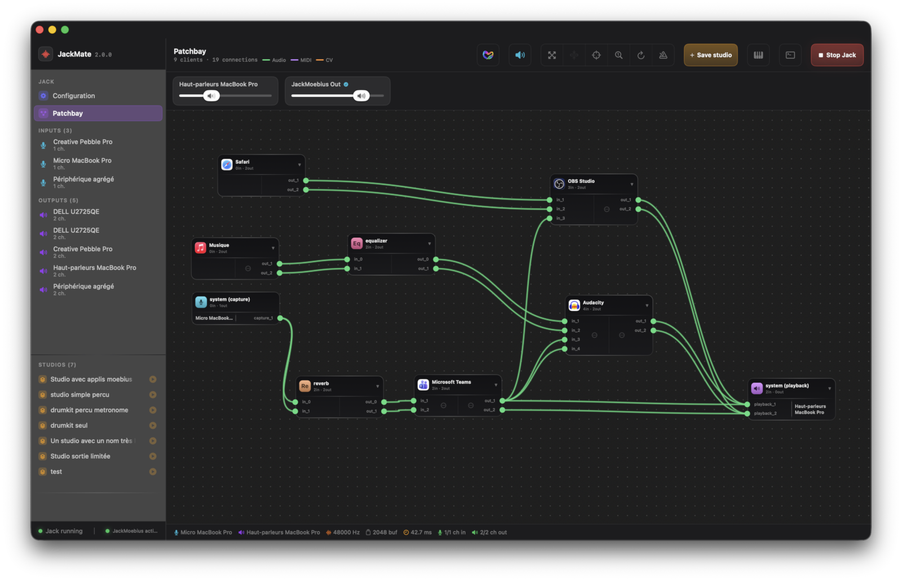
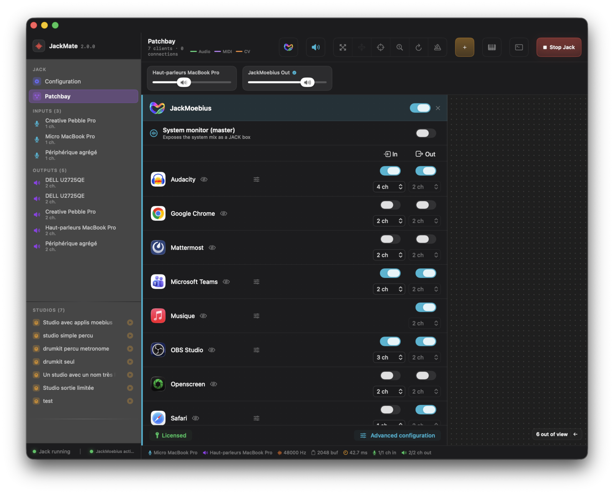
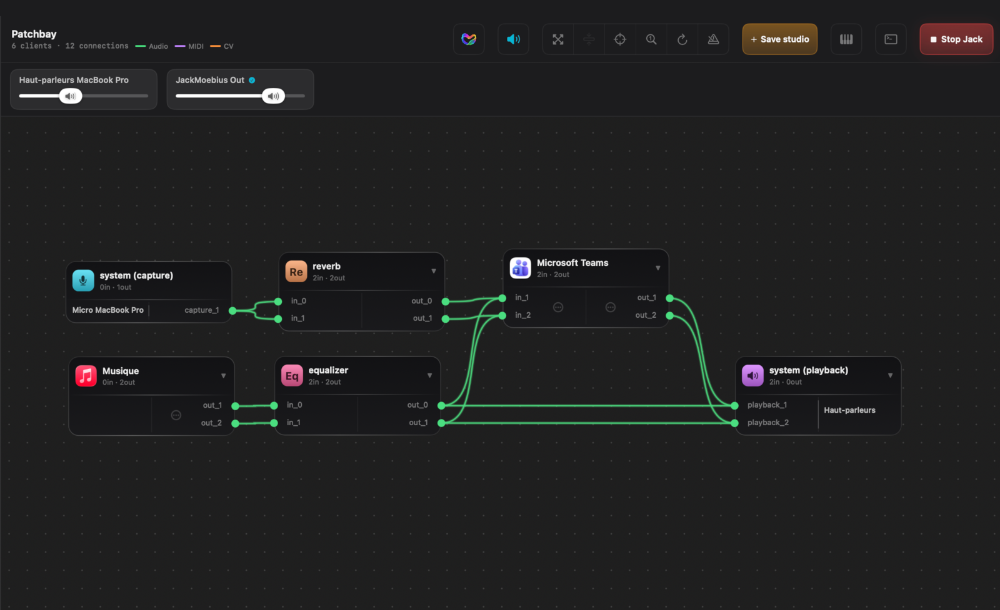
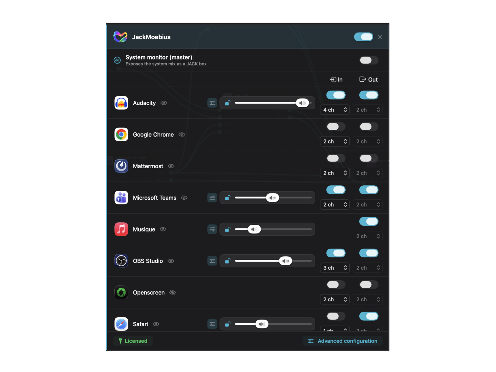
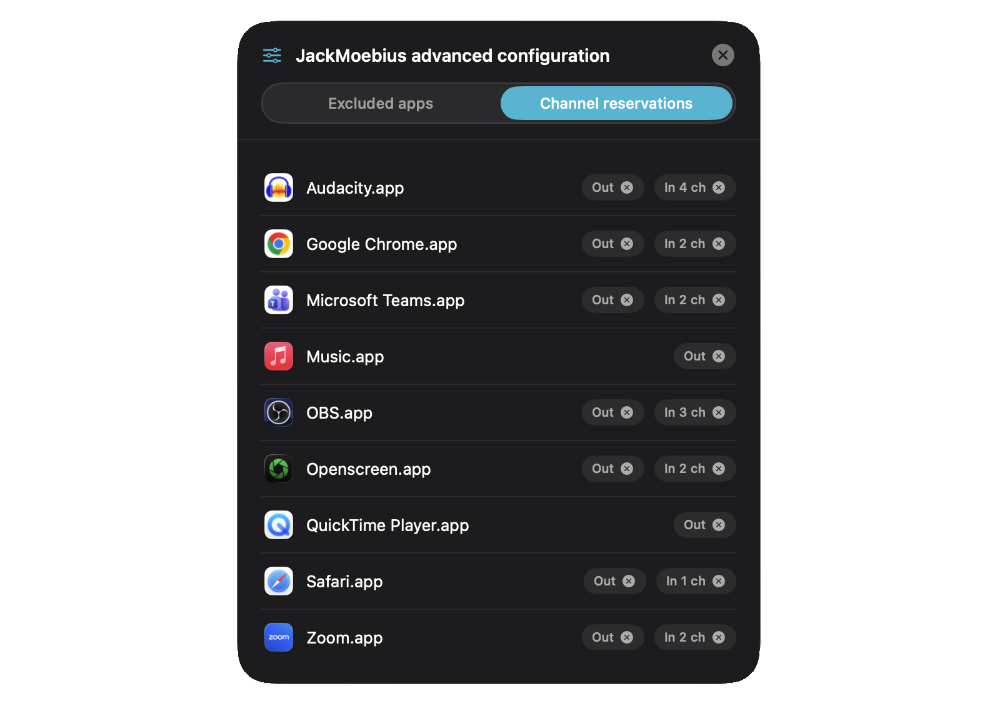
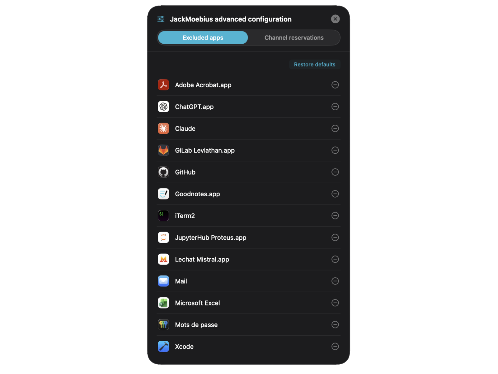
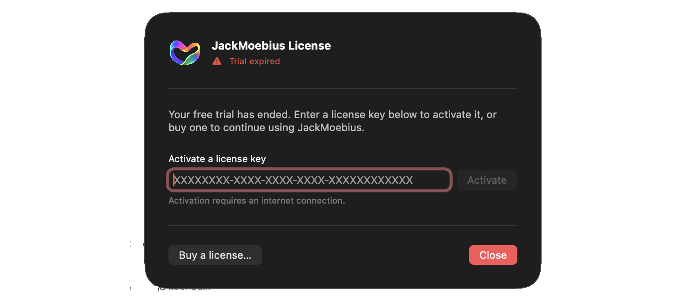

```{=html}
<div class="hero">
  <div class="hero-inner">
    
    <div class="hero-text">
      <h1>JackMoebius</h1>
      <p class="subtitle">Route any macOS CoreAudio app to and from JACK, per app and bidirectionally. A virtual audio driver + daemon that brings your apps into the JACK graph, best controlled from the <a href="https://jackmate.app">JackMate</a> GUI. <a href="video.html" onclick="openVideoLightbox(event)"><i class="fa-solid fa-circle-play"></i> See it in action</a>.</p>
      <div class="hero-pills">
        <a href="https://github.com/zinc75/JackMoebius/releases/download/v/JackMoebius-.dmg" class="hero-pill hero-pill-primary" id="download-btn" onclick="openDownloadModal(event)">
          <i class="fa-brands fa-apple"></i> Download trial
        </a>
        <a href="?embed=1" class="hero-pill hero-pill-buy lemonsqueezy-button" id="buy-btn">
          <i class="fa-solid fa-key"></i> Buy a license
        </a>
        <a href="guide/how-it-works.html" class="hero-pill hero-pill-secondary">
          <i class="fa-solid fa-book-open"></i> Getting started
        </a>
      </div>
      <div class="hero-trust">
        <span class="fa-stack hero-seal" aria-hidden="true">
          <i class="fa-solid fa-certificate fa-stack-2x"></i>
          <i class="fa-solid fa-check fa-stack-1x"></i>
        </span>
        Signed &amp; notarized by Apple
      </div>
    </div>
  </div>
</div>

<!-- Video lightbox — opened from the "See it in action" link; the Vimeo iframe
     is injected on open (page stays light) and removed on close (stops playback). -->
<div id="video-lightbox" class="vlb-overlay" role="dialog" aria-modal="true" aria-label="JackMoebius video">
  <button class="vlb-close" type="button" aria-label="Close">&times;</button>
  <div class="vlb-frame" id="vlb-frame"></div>
</div>
<style>
.vlb-overlay { position:fixed; inset:0; z-index:99999; display:none; align-items:center; justify-content:center; padding:4vh 4vw; background:rgba(0,0,0,.85); backdrop-filter:blur(4px); }
.vlb-overlay.is-open { display:flex; }
.vlb-frame { position:relative; width:100%; max-width:1000px; aspect-ratio:16/9; }
.vlb-frame iframe { position:absolute; inset:0; width:100%; height:100%; box-sizing:border-box; border:1px solid rgba(255,255,255,.9); border-radius:12px; box-shadow:0 24px 80px rgba(0,0,0,.6); }
.vlb-close { position:absolute; top:1rem; right:1.25rem; z-index:3; display:flex; align-items:center; justify-content:center; width:44px; height:44px; border:1px solid rgba(255,255,255,.55); border-radius:50%; background:rgba(0,0,0,.65); color:#fff; font-size:1.6rem; line-height:1; cursor:pointer; backdrop-filter:blur(2px); }
.vlb-close:hover { background:rgba(0,0,0,.75); }
</style>
<script>
(function () {
  var SRC = "https://player.vimeo.com/video/1230395347?badge=0&autopause=0&autoplay=1";
  var ov = document.getElementById('video-lightbox');
  var frame = document.getElementById('vlb-frame');
  if (!ov || !frame) return;
  document.body.appendChild(ov);          // out of the content stacking context, so it covers the navbar
  window.openVideoLightbox = function (e) {
    if (e) e.preventDefault();
    frame.innerHTML = '<iframe src="' + SRC + '" allow="autoplay; fullscreen; picture-in-picture" allowfullscreen title="JackMoebius: See it in action"></iframe>';
    ov.classList.add('is-open');
    document.body.style.overflow = 'hidden';
  };
  function close() {
    ov.classList.remove('is-open'); frame.innerHTML = ''; document.body.style.overflow = '';
    if (location.hash === '#video') history.replaceState(null, '', location.pathname + location.search);
  }
  ov.addEventListener('click', function (e) { if (e.target === ov) close(); });
  ov.querySelector('.vlb-close').addEventListener('click', close);
  document.addEventListener('keydown', function (e) { if (e.key === 'Escape' && ov.classList.contains('is-open')) close(); });
  // Deep link: opening the home at /#video (e.g. from the GitHub README thumbnail) auto-plays.
  function openIfHash() { if (location.hash === '#video') window.openVideoLightbox(); }
  openIfHash();
  window.addEventListener('hashchange', openIfHash);
})();
</script>
```

```{=html}
<!-- Modal: Windows / Linux confirmation -->
<div id="dm-confirm-modal" class="dm-overlay" role="dialog" aria-modal="true" aria-labelledby="dm-confirm-title">
  <div class="dm-dialog dm-dialog-sm">
    <div class="dm-header">
      <div class="dm-header-icon icon-bg-violet"><i class="fa-brands fa-apple"></i></div>
      <div>
        <h2 id="dm-confirm-title" class="dm-title">JackMoebius is a macOS driver</h2>
        <p class="dm-intro">This installer only runs on macOS. Download anyway?</p>
      </div>
    </div>
    <div class="dm-footer">
      <button class="dm-cancel-btn" id="dm-confirm-cancel">Cancel</button>
      <button class="dm-close-btn" id="dm-confirm-ok">Download anyway</button>
    </div>
  </div>
</div>

<!-- Modal: iOS / Android -->
<div id="dm-mobile-modal" class="dm-overlay" role="dialog" aria-modal="true" aria-labelledby="dm-mobile-title">
  <div class="dm-dialog dm-dialog-sm">
    <div class="dm-header">
      <div class="dm-header-icon icon-bg-violet"><i class="fa-brands fa-apple"></i></div>
      <div>
        <h2 id="dm-mobile-title" class="dm-title">JackMoebius is a macOS driver</h2>
        <p class="dm-intro">It's a CoreAudio driver for the Mac, so it can't run on iPhone or iPad. Come back from a Mac to download it.</p>
      </div>
    </div>
    <div class="dm-footer dm-footer-end">
      <button class="dm-close-btn" id="dm-mobile-ok">Got it</button>
    </div>
  </div>
</div>

<!-- Modal: macOS — download started + clean install (signed & notarized) -->
<div id="download-modal" class="dm-overlay" role="dialog" aria-modal="true" aria-labelledby="dm-title">
  <div class="dm-dialog">
    <div class="dm-header">
      <div class="dm-header-icon icon-bg-cyan"><i class="fa-brands fa-apple"></i></div>
      <div>
        <h2 id="dm-title" class="dm-title">Your download has started</h2>
        <p class="dm-intro"><strong>Signed and notarized by Apple</strong>, it installs cleanly, with no Gatekeeper warnings. Here's how:</p>
      </div>
    </div>

    <ol class="dm-steps">
      <li>Open the downloaded <strong>.dmg</strong>.</li>
      <li>Run <strong>Install JackMoebius.pkg</strong> and follow the installer (you'll accept the license).</li>
      <li>macOS asks you to <strong>restart</strong>, and the audio driver loads at the next boot.</li>
    </ol>

    <div class="dm-footer">
      <p class="dm-bmac-note"><i class="fa-solid fa-shield-halved"></i> Signed &amp; notarized by Apple. Free to try for 14 days; a license unlocks it afterwards.</p>
      <button class="dm-close-btn" id="modal-close-bottom">Got it</button>
    </div>
  </div>
</div>
```

## What it does

```{=html}
<style>
.jm-grid { display:grid; grid-template-columns:repeat(3,1fr); gap:1.2rem; margin:2rem 0 3rem; }
@media (max-width:900px){ .jm-grid{ grid-template-columns:repeat(2,1fr); } }
@media (max-width:600px){ .jm-grid{ grid-template-columns:1fr; } }
.jm-card { border:1px solid var(--jm-border-med); border-radius:16px; background:var(--jm-bg-card); padding:1.6rem 1.5rem; }
.jm-card .ic { width:2.8rem; height:2.8rem; border-radius:13px; display:inline-flex; align-items:center; justify-content:center; margin-bottom:1rem; font-size:1.1rem; }
.jm-card .ic i { color:#fff !important; }
.jm-card h3 { font-size:1.1rem; font-weight:700; margin:0 0 .5rem; color:var(--jm-text); }
.jm-card p  { font-size:.9rem; color:var(--jm-text-dim); line-height:1.65; margin:0; }
</style>

<div class="jm-grid">
  <div class="jm-card">
    <span class="ic icon-bg-cyan"><i class="fa-solid fa-right-left"></i></span>
    <h3>Bidirectional</h3>
    <p>An app's <strong>output</strong> flows into JACK, and JACK can feed an app's <strong>input</strong>, so you can process a live instrument and send it straight back into a call.</p>
  </div>
  <div class="jm-card">
    <span class="ic icon-bg-orange"><i class="fa-solid fa-boxes-stacked"></i></span>
    <h3>Per application</h3>
    <p>One JACK box per exposed app. Output and input are independent, each with its own persistent channel reservation.</p>
  </div>
  <div class="jm-card">
    <span class="ic icon-bg-violet"><i class="fa-solid fa-wand-magic-sparkles"></i></span>
    <h3>Transparent</h3>
    <p>No plug-in, no reconfiguration inside the app, no aggregate devices needed. Its audio simply appears in the JACK graph: Safari, Music, FaceTime, a DAW helper, anything CoreAudio.</p>
  </div>
  <div class="jm-card">
    <span class="ic icon-bg-green"><i class="fa-solid fa-microchip"></i></span>
    <h3>Universal &amp; native</h3>
    <p>An AudioServerPlugIn driver + a Swift daemon, <strong>signed and notarized by Apple</strong>. Apple Silicon and Intel, macOS 15+. No kernel extension, no SIP changes.</p>
  </div>
  <div class="jm-card">
    <span class="ic icon-bg-amber"><i class="fa-solid fa-terminal"></i></span>
    <h3>Scriptable</h3>
    <p>A <code>jackmoebius</code> command-line tool and a documented, event-driven IPC protocol lets you automate routing or build your own front-end.</p>
  </div>
  <div class="jm-card">
    <span class="ic icon-bg-red"><i class="fa-solid fa-sliders"></i></span>
    <h3>Studio-ready</h3>
    <p>Per-app volumes, live routing status, persistent reservations. A <a href="https://jackmate.app">JackMate</a> studio restores your whole wiring in one click.</p>
  </div>
</div>
```

## Controlled from JackMate

**[JackMate](https://jackmate.app)** (a free, standalone JACK patchbay &
manager) is the recommended way to drive JackMoebius, and the installer sets it up
alongside (optional, opt-out at install time). Activate your JackMoebius license, expose
apps, patch them and set per-app volumes, all visually.

::: {.carousel effect="coverflow" thumbs="false" lazy="true" dots="true" autoplay="3000"}















:::

<!-- Screenshot carousel — EmilHvitfeldt/quarto-easycarousel.
     Install once (vendors into _extensions/, commit it):
         quarto add EmilHvitfeldt/quarto-easycarousel
     Each  INSIDE the ::: {.carousel} block above is one slide; clicking a
     slide is reachable via the thumbnail strip below. PNGs under assets/screenshots/
     are auto-copied into _site (Markdown image refs + the resources glob).
     Add slides by pasting these lines inside the block, one per screenshot, blank line
     between each (drop the matching PNG in assets/screenshots/ first):

     

     

     
-->

## How it works

JackMoebius installs a per-app **AudioServerPlugIn** virtual device. When you expose
an app, its CoreAudio stream is captured by the **`jackmoebiusd`** daemon and bridged
into JACK as a dedicated client, and the reverse path lets JACK feed the app's input.
The daemon keeps the JACK graph and the routing in sync, event-driven, with no polling.

→ Read the full explanation in **[How it works](guide/how-it-works.html)**, the
**[IPC protocol](guide/ipc.html)**, and the **[CLI reference](guide/cli.html)**.

## Requirements

| | Minimum |
|---|---|
| macOS | 15.0 (Sequoia) |
| Architecture | Apple Silicon or Intel |
| JACK | JACK2 (`jackd` / `jackdmp`) installed and running |
| GUI (recommended) | [JackMate](https://jackmate.app), installed alongside |

::: {.callout-note}
JackMoebius is **proprietary software** with a **14-day free trial**. A **one-time
purchase**, no subscription, with all updates included. [Buy a license](?embed=1){.lemonsqueezy-button}.
:::
